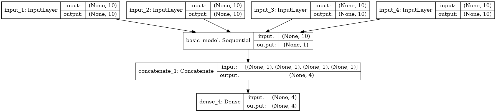

# Deep-Q-learning-DQN-for-job-shop
This is the python code of deep q learning method for job shop problem with keras.

# environment

python 3.6 
keras 
numpy

# Usage 

python3 dqn.py

# The stable 4*5 job shop problem 

## problem description

```python 
self.M_processing_order = np.array(
    [[1, 3, 0, 2], [0, 2, 1, 3], [3, 1, 2, 0], [1, 3, 0, 2], [0, 1, 2, 3]])
self.M_processing_time = np.array([[18, 20, 21, 17], [18, 26, 15, 16], [
    17, 18, 27, 23], [18, 21, 25, 15], [22, 29, 28, 21]])
```


## The structure of the network



## Output of the code 

``` txt
loop : 840/10000,  score: 143.0 success: 0 / 10, e: 0.014
[3, 0, 1, 2, 4, 3, 1, 0, 2, 4, 0, 3, 2, 1, 4, 3, 0, 1, 2, 4] 20
loop : 850/10000,  score: 143.0 success: 1 / 10, e: 0.014
[1, 0, 3, 1, 2, 4, 0, 3, 2, 4, 0, 3, 1, 2, 1, 4, 0, 3, 2, 1] 20
loop : 860/10000,  score: 143.0 success: 0 / 10, e: 0.013
[3, 1, 0, 4, 3, 1, 0, 2, 4, 2, 0, 3, 2, 1, 4, 3, 1, 0, 4, 2] 20
loop : 870/10000,  score: 143.0 success: 1 / 10, e: 0.012
[4, 3, 0, 3, 1, 1, 0, 4, 2, 2, 4, 0, 3, 1, 4, 2, 3, 1, 0, 4] 20
loop : 880/10000,  score: 143.0 success: 1 / 10, e: 0.012
[1, 0, 4, 3, 2, 1, 0, 4, 2, 3, 0, 3, 1, 4, 2, 1, 0, 4, 3, 0] 20
```

# The random 4*5 job shop problem 

## problem description

random 4*5 problem create by function 

JobShop.py line 100

## The structure of the network

same as stable: 


## Output of the code 

``` txt

[2, 1, 0, 3, 4, 1, 0, 3, 2, 4, 2, 0, 3, 1, 4, 2, 0, 1, 3, 4] 20
loop : 2720/10000,  score: 156.0 success: 7 / 10, e: 0.01
[0, 3, 1, 4, 2, 1, 4, 0, 3, 2, 4, 0, 3, 2, 1, 0, 3, 1, 4, 2] 20
loop : 2730/10000,  score: 172.0 success: 3 / 10, e: 0.01
[2, 2, 1, 4, 3, 0, 3, 1, 4, 2, 0, 0, 3, 1, 4, 2, 1, 4, 3, 0] 20
loop : 2740/10000,  score: 143.0 success: 2 / 10, e: 0.01
[2, 1, 0, 3, 1, 4, 0, 3, 2, 4, 2, 0, 3, 1, 4, 2, 1, 0, 3, 4] 20
loop : 2750/10000,  score: 143.0 success: 2 / 10, e: 0.01
[0, 1, 3, 2, 1, 4, 0, 3, 2, 4, 0, 3, 2, 1, 4, 0, 1, 3, 2, 4] 20
loop : 2760/10000,  score: 143.0 success: 4 / 10, e: 0.01
[2, 1, 0, 3, 1, 0, 4, 2, 3, 4, 2, 0, 1, 3, 4, 2, 1, 0, 3, 4] 20

```

